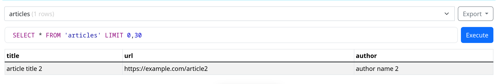

> edit 1

you only need to do 

```sh
pip install bs4 requests
```

csv and sqlite come with the python standard library , so no need to re-install

also, the venv.py is still in development, please dont run it. it is going into infinite loops and breaking the project folder. i will look more into it and update later, as it is not the main issue right now.

`example.html` shows a sample website that the `scrape.py` would work for.

enquire for author 2 details to get [author_articles.csv](author_articles.csv) and [author_articles.db](author_articles.db)



> orginal readme

# plan

target on particular authors at first. and scrape data related to them using BeautifulSoup and requests

```py
import requests
from bs4 import BeautifulSoup
```

request library is used to make `get` requests to a particular web page

and the bs4 library is used to `parse` the html content that we get.

have to work a plan on how to be compatible with various different websites, but if we focus on a few particular websites, we can make shit work alteast for now.
